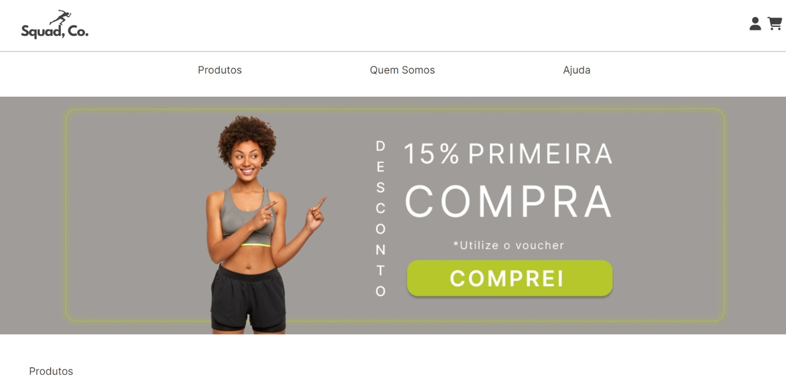
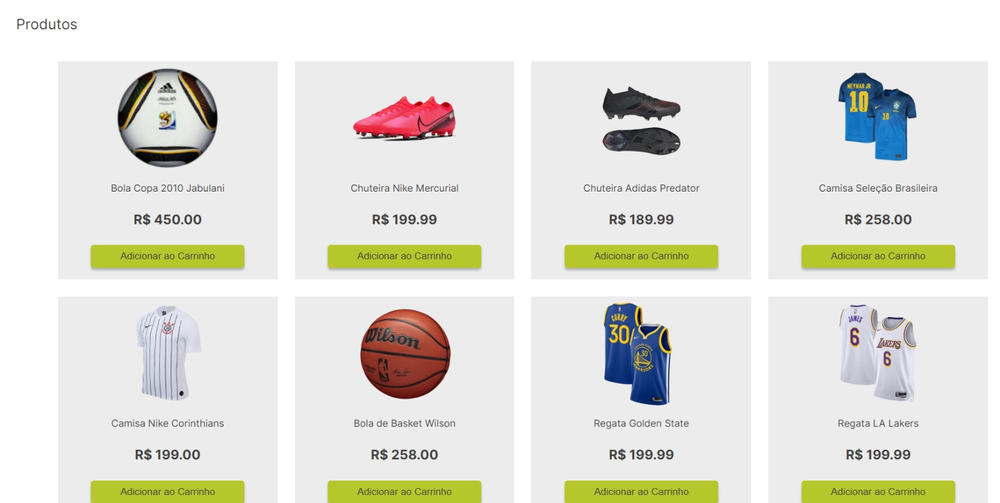
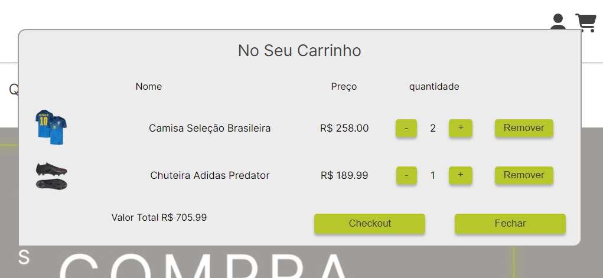

# Nuback React Descomplica

## Table of contents

- [Overview](#overview)
  - [The challenge](#the-challenge)
  - [Screenshot](#screenshot)
  - [Links](#links)
- [My process](#my-process)
  - [Built with](#built-with)
  - [Build Process](#what-i-learned)
- [Author](#author)

## Overview

Challenge made for Nubank Course. 

The challenge is to develop a user-friendly shopping application that enables customers to effortlessly perform key actions. The primary objectives are:

- Adding Products to the Cart: Users should be able to easily add products to their shopping cart. The process should be intuitive, providing clear options for adding items with minimal effort.

- Simulating Database Functionality: The application should effectively replicate the functions typically performed by a database. By utilizing an object array, we aim to create a seamless experience where product data is accessed and retrieved as if it were obtained from a real database.

- Efficient Data Mapping: The application should efficiently map the data from the object array to the appropriate components. This mapping process should be optimized to accurately represent the product information and maintain optimal performance.

- Viewing Cart Value: Users should have instant visibility into the total value of items in their cart. This real-time update allows users to stay informed about their purchases and make informed decisions.

- Removing or Adjusting Item Quantity: Users should be able to conveniently remove items from the cart or adjust their quantity. The interface should provide simple and accessible options for modifying the cart contents to suit individual preferences.

By addressing these challenges effectively, our goal is to create a streamlined shopping experience, maximizing user satisfaction and facilitating smooth transactions.

### Screenshot

- Home Page

- Products

- Cart

### Links

- Live Site URL: [Github Pages](https://leopk05.github.io/Descomplica-React/)
- Figma Prototype: [Figma Link](https://www.figma.com/file/HjvZtng5Fu77xr8Bw7Ctb9/Wireframe-Site?type=design&mode=design&t=7vOKRQeYlueP5TiF-0)

## My process

### Built with

- Figma
- React Js

### Build Process

Building this project has been an incredibly rewarding experience. We had the opportunity to learn and apply our knowledge in various aspects of the development process. The initial prototype, skillfully crafted by Evelyn and Fran using Figma, showcased a stunning and fluid design. It incorporated a range of UI and UX features, including easily accessible buttons and seamless navigation throughout the pages.

When it came to the implementation phase, I took charge and successfully developed six key components:

- Homepage: This component serves as the initial landing page, displaying all the content that loads when the user accesses the website. It does not rely on any prop elements to pass data from the app.

- Products: A single component responsible for loading the object array, which is passed as props from the app to the Products component. By utilizing a mapping function, the Products component dynamically replicates the Product component based on the size of the array.

- Cart: The Cart component plays a vital role in calculating and displaying the contents of the shopping cart. It dynamically adjusts its appearance based on the size of the product array: one return style if the array is empty (0 size), and another return style if there are products present. The Cart component also includes essential elements such as a close button, a checkout button, and the total value of the items in the cart.

- Item in Cart: This component enhances the display of individual items within the cart area. It provides a visually appealing layout for displaying product images and is repeated for each item, much like the Products component.

- About Us and Contact Area: These two components add an aesthetic touch to the website, contributing to an overall visually appealing and engaging user experience.

Throughout the development process, we have gained valuable insights and honed our skills while creating a beautiful and functional project.

## Author

### Evelyn

- LinkedIn https://www.linkedin.com/in/evelynmatoso/

### Fran

- LinkedIn https://www.linkedin.com/in/franciane-lark/
- GitHub https://github.com/franciane-lark

### Leo

- LinkedIn https://www.linkedin.com/in/leonardo-weslley/
- GitHub https://github.com/leopk05

